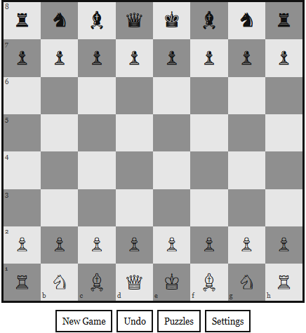
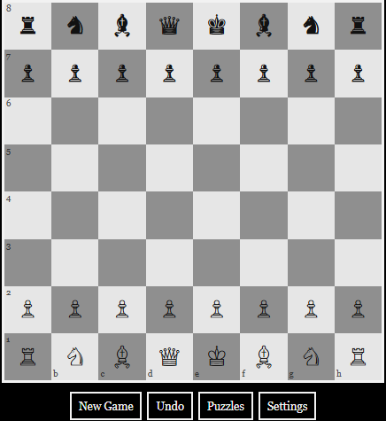
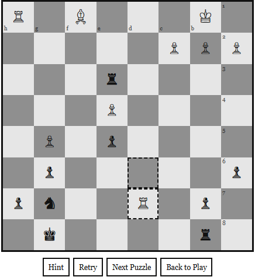
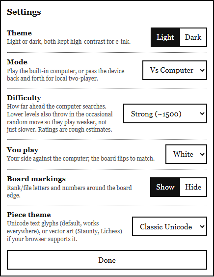

# Kindle Chess

A chess website built for Kindle's e-ink browser. It's a plain HTML/CSS/JS
page: no animations, no build step, high-contrast light and dark themes, and
it keeps working offline once it's loaded once. You can play against a
built-in computer opponent (with several difficulty levels) or pass the
device between two players, and there's a puzzle mode for practicing
tactics.

## Screenshots

| Play | Dark mode |
| --- | --- |
|  |  |

| Puzzles | Settings |
| --- | --- |
|  |  |

## How to use it

- Tap a piece, then tap a square to move
- Use the **Settings** button to change mode, difficulty, pieces, theme,
  and board markings
- Use the **Puzzles** button to practice tactics
- Use **Refresh** to clear screen ghosting on e-ink

## Running it

It's just a website — there's no app to install. Open `index.html` in a
browser, or host the folder anywhere that serves static files (GitHub
Pages, Vercel, Netlify, etc.) and visit that URL from the Kindle's browser.

## Credits

- Chess rules by [chess.js](https://github.com/jhlywa/chess.js)
- Piece art and puzzles from [Lichess](https://lichess.org) (open licensed)
- Inspired by [einkchess.fun](https://einkchess.fun/), another e-ink-focused
  chess site
